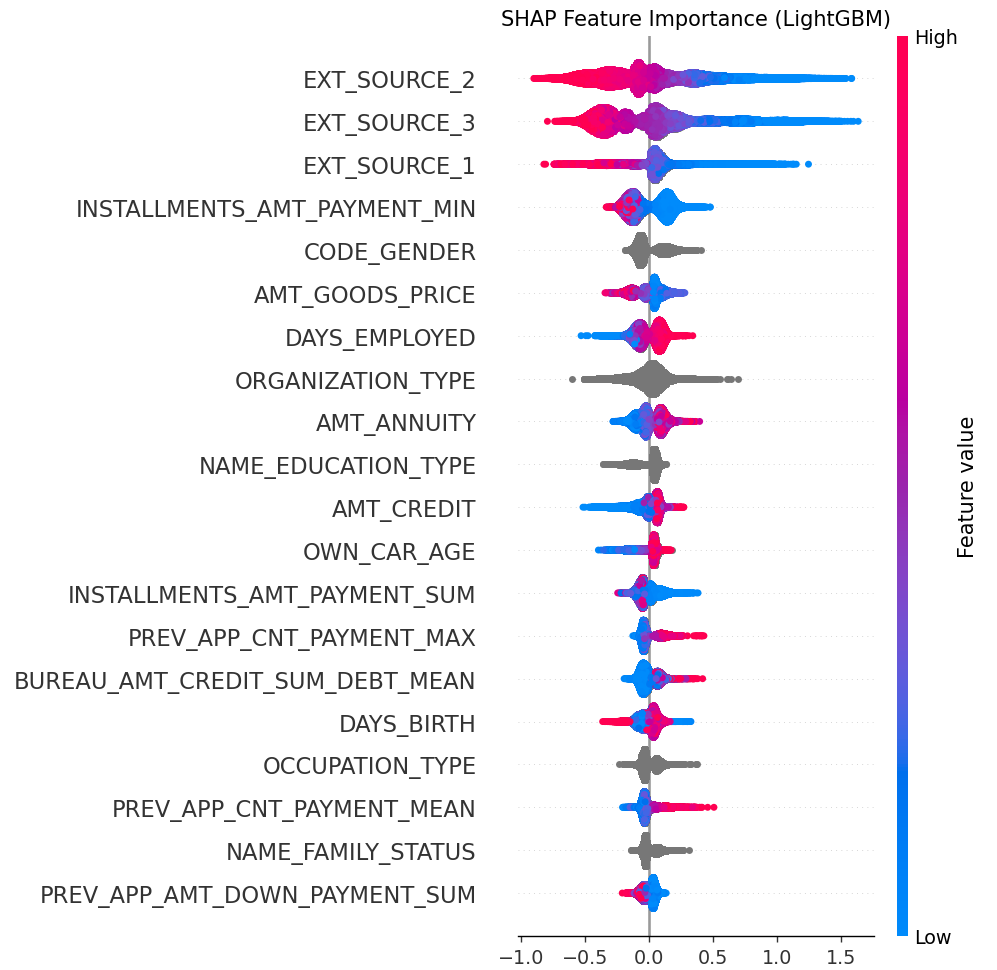
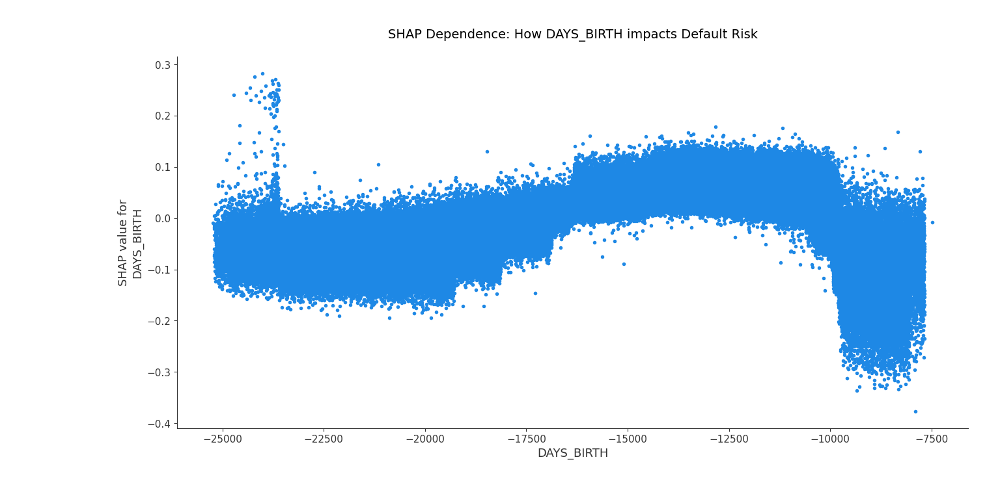

# ShiftHappens - Model Development

## Overview
This directory contains the end-to-end model development pipeline for **ShiftHappens**, a lightweight MLOps monitoring platform for SMEs. Using the Home Credit Default Risk dataset, we train, validate, and evaluate machine learning models to simulate a production credit scoring system. The pipeline covers model training, hyperparameter tuning, validation, bias detection, and registry push — all orchestrated via Apache Airflow.

## Repository Structure
* `scripts/`: Modular Python scripts for preprocessing, training, validation, bias detection, and registry push.
* `dags/`: Apache Airflow DAG definition (`model_pipeline_dag.py`) that orchestrates the full pipeline.
* `tests/`: Unit tests using `pytest` to validate preprocessing and model training logic.
* `reports/`: Auto-generated charts and reports from model runs (confusion matrices, ROC curves, bias charts).
* `models/`: Saved model `.pkl` files generated at runtime.
* `logs/`: Execution logs for every script.
* `.github/workflows/`: GitHub Actions CI/CD pipeline for automated model training and validation.

## Pipeline Architecture
The model development pipeline follows these steps in order:

```
preprocessor.py          → Encode + impute + Fairlearn CorrelationRemover
      ↓
model_trainer.py         → Train Logistic Regression + LightGBM → Select best by AUC
      ↓
hyperparameter_tuner.py  → RandomizedSearchCV on best model
      ↓
model_validator.py       → Validate on hold-out set → ROC/PR curves
      ↓
bias_detector.py         → Fairlearn MetricFrame slicing by gender
      ↓
model_selection.py       → Final gate — validation + bias results combined
      ↓
registry_push.py         → Push to GCP with rollback mechanism
```

## Environment Setup & Reproducibility
Ensure Python 3.10+ is installed and follow these steps:

1. Clone the repository:
```bash
git clone https://github.com/semwalhritvik/shift-happens.git
cd shift-happens/Model-Development
```

2. Create and activate a virtual environment:
```bash
python3 -m venv venv
source venv/bin/activate
```

3. Install dependencies:
```bash
pip install -r requirements.txt
```

4. Ensure the Data Pipeline has been run first so this file exists:
```
data/processed/application_train_merged.pkl
```

## Running the Pipeline

### Option A — Run scripts individually (recommended for development)
```bash
python3 scripts/preprocessor.py
python3 scripts/model_trainer.py
python3 scripts/hyperparameter_tuner.py
python3 scripts/model_validator.py
python3 scripts/bias_detector.py
python3 scripts/model_selection.py
python3 scripts/registry_push.py
```

### Option B — Trigger Airflow DAG (recommended for production)
```bash
airflow dags trigger shifthappens_model_pipeline
```
Navigate to `http://localhost:8080` to monitor progress.

### Option C — CI/CD via GitHub Actions
Push any change to `scripts/` or `dags/` and the full pipeline runs automatically.

## Model Training & Selection
We trained two candidate models and compared them across all key metrics:

* **Logistic Regression** — interpretable baseline model with `class_weight='balanced'` to handle the 8% positive class imbalance.
* **LightGBM** — gradient boosting model with 300 estimators and learning rate 0.05, also with `class_weight='balanced'`.

The model with the highest **ROC-AUC** on the hold-out test set is automatically selected as the production model. All runs are tracked in **MLflow** with hyperparameters, metrics, and model artifacts logged per run.

### Model Comparison Results


| Model | ROC-AUC | F1 Score | Accuracy | Precision | Recall |
|---|---|---|---|---|---|
| **LightGBM** ✅ Winner | **0.7779** | **0.2897** | **0.7335** | **0.1846** | **0.6733** |
| Logistic Regression | 0.6785 | 0.2169 | 0.6165 | — | — |

**LightGBM was selected** as the best model based on highest ROC-AUC score.

## Confusion Matrices

### LightGBM


### Logistic Regression


## Hyperparameter Tuning
We used `RandomizedSearchCV` with 20 iterations and 3-fold cross-validation to optimise LightGBM hyperparameters. The search space covered:

* `n_estimators`: 100–600
* `learning_rate`: 0.01–0.20
* `num_leaves`: 20–100
* `max_depth`: 3–10
* `subsample`: 0.6–1.0

**Best parameters found:**
* `learning_rate`: 0.0497
* `max_depth`: 9
* `n_estimators`: 238
* `num_leaves`: 27
* `subsample`: 0.8916
* **Best CV ROC-AUC: 0.7729**

All tuning runs are tracked in MLflow under the `ShiftHappens_Model_Development` experiment.

## Model Validation
The tuned LightGBM model was validated on a **hold-out test set (20% of data)** that was never used during training. Validation metrics and curves are saved to `reports/`.

### ROC & Precision-Recall Curves


### Validation Results
| Metric | Score | Threshold | Status |
|---|---|---|---|
| ROC-AUC | 0.7779 | ≥ 0.70 | ✅ PASSED |
| F1 Score | 0.2897 | ≥ 0.25 | ✅ PASSED |
| Accuracy | 0.7335 | ≥ 0.60 | ✅ PASSED |

The F1 score of 0.29 is realistic for this dataset given the severe class imbalance (only 8% of loans default). ROC-AUC is the primary metric as it handles imbalanced classes correctly.

## Bias Detection & Mitigation
We implement a two-stage fairness strategy following Fairlearn best practices.

### Pre-processing Mitigation — CorrelationRemover
Before training, `CorrelationRemover` in `preprocessor.py` mathematically removes the linear correlation between all features and `CODE_GENDER`. This ensures the model cannot learn gender-based patterns from the data.

### Post-training Detection — MetricFrame Slicing
After training, `bias_detector.py` uses Fairlearn's `MetricFrame` to slice the test data by gender groups and evaluate accuracy, false positive rate, and true positive rate per group.

### Bias Detection Results


| Group | Accuracy | False Positive Rate | True Positive Rate |
|---|---|---|---|
| Group 0 (Male) | 0.7743 | 0.2133 | 0.6093 |
| Group 1 (Female) | 0.6545 | 0.3573 | 0.7586 |
| Group 2 (XNA) | 0.5000 | 0.5000 | 0.0000 |

**Bias was detected** across gender groups with maximum disparity of 0.2743 in accuracy. This is expected even after CorrelationRemover as it only removes linear correlations.

### Mitigation Strategy & Trade-offs
* **Applied:** Fairlearn `CorrelationRemover` at preprocessing — removes linear gender correlation before training
* **Recommended next step:** `ThresholdOptimizer` post-processing — adjusts decision thresholds per group to equalise outcomes
* **Trade-off:** Applying stricter fairness constraints may slightly reduce overall accuracy but improves equity across demographic groups

### Final Model Selection Gate
`model_selection.py` combines both validation and bias results before approving deployment:

* Validation PASSED ✅ + Bias detected ⚠️ → **APPROVED WITH WARNING**
* Mitigation documented and ThresholdOptimizer recommended as next step

## Experiment Tracking
All model runs are tracked using **MLflow**. To view the dashboard:
```bash
mlflow ui
# Open → http://localhost:5000
```

Each run logs:
* Hyperparameters
* Performance metrics (AUC, F1, accuracy, precision, recall)
* Model artifacts (confusion matrices, ROC curves)
* Model binary for version control

## Unit Testing
We follow Test-Driven Development (TDD) using `pytest`. The `tests/` directory contains unit tests validating preprocessing and model training logic.

```bash
pytest tests/ -v
```

Tests cover:
* Preprocessing output shapes are consistent
* No NaN values after preprocessing
* Target column contains only 0 and 1
* Both models are trained and returned
* Best model always has the highest ROC-AUC
* All metrics are within valid range (0 to 1)

## CI/CD Pipeline
GitHub Actions automatically triggers the full model pipeline on every push to `scripts/` or `dags/`. The pipeline runs in this order:

1. Install dependencies
2. Authenticate to GCP
3. Run unit tests
4. Train models
5. Tune hyperparameters
6. Validate model
7. Run bias detection
8. Run SHAP sensitivity analysis
9. Push to GCP registry
10. Upload reports as artifacts

If any step fails, a notification is posted automatically.

## GCP Model Registry
Once the model passes validation and bias checks, it is pushed to **Google Cloud Storage** as the model registry. A rollback mechanism compares the new model's AUC against the previous production model — if the new model performs worse, the push is blocked and the existing model stays in production.

```bash
export GOOGLE_APPLICATION_CREDENTIALS=path/to/credentials.json
export GCP_PROJECT=shifthappens-project
export GCS_BUCKET=shifthappens-model-registry
python3 scripts/registry_push.py
```

## Reports Generated
All saved to `reports/` at runtime:

| File | Description |
|---|---|
| `model_comparison.png` | Bar chart comparing LR vs LightGBM across all metrics |
| `confusion_matrix_LightGBM.png` | LightGBM predictions vs actuals |
| `confusion_matrix_LogisticRegression.png` | LR predictions vs actuals |
| `roc_pr_curves_LightGBM.png` | ROC and Precision-Recall curves |
| `classification_report_LightGBM.txt` | Full precision/recall/F1 per class |
| `bias_by_group_LightGBM.png` | Fairness metrics by gender group |
| `bias_report_LightGBM.txt` | Full disparity numbers across groups |


## Model Interpretability (SHAP Analysis)
To ensure our model's decisions are transparent, fair, and easily explainable to stakeholders, we implemented SHAP (SHapley Additive exPlanations) using the highly optimized TreeExplainer.

1. Global Feature Importance
   


The global summary plot reveals the top drivers of default risk across the entire dataset:

External Sources: Normalized scores from external credit data providers (EXT_SOURCE_1, 2, and 3) dominate the model's decision-making process. Low external scores strongly push the model toward predicting a default.

Historical Behaviors: Engineered features from our Airflow pipeline, such as INSTALLMENTS_AMT_PAYMENT_MIN, play a significant role, proving the value of our upstream relational data aggregation.

1. Categorical Risk Drivers: Occupation Type
   


By utilizing SHAP dependence plots, we opened the "black box" to unpack the exact risk assigned to non-ordinal categories:

High-Risk Roles: The model identified "Low-skill Laborers" and "Drivers" as having a heavily increased historical risk of default.

Low-Risk Roles: Occupations like "Accountants" and "Core staff" consistently lower the predicted risk score.

The Power of 'Missing': Applicants who declined to state their occupation actually lean slightly toward lower risk. This validates our pipeline decision to explicitly label missing data rather than simply dropping or blindly imputing it.

1. Continuous Risk Discovery: Age Dynamics
   


The dependence plot for DAYS_BIRTH showcases LightGBM's ability to capture complex, non-linear relationships that traditional linear models miss:

The Mid-Life Plateau: The highest risk concentration occurs among applicants in their late 20s to late 40s.

The Retirement Spike: The model independently discovered a sharp, sudden spike in default risk at approximately 65 years of age (around -24,000 days), effectively pinpointing the financial instability that can accompany the transition to fixed retirement incomes.

## CI/CD Pipeline — Google Cloud Build

The model development pipeline is fully automated using **Google Cloud Build** with a GitHub trigger. Every push to the `main` branch automatically triggers the full pipeline — from data loading to model deployment.

### Pipeline Architecture

```
GitHub Push (main branch)
      ↓
Cloud Build Trigger
      ↓
Download Data from GCS
      ↓
Install Dependencies
      ↓
preprocessor.py          → Encode + impute + CorrelationRemover
      ↓
model_trainer.py         → Train LR + LightGBM → Select best by AUC
      ↓
hyperparameter_tuner.py  → RandomizedSearchCV on best model
      ↓
model_validator.py       → Validate on hold-out set → ROC/PR curves
      ↓
bias_detector.py         → Fairlearn MetricFrame slicing by gender
      ↓
model_selection.py       → Final gate — validation + bias combined
      ↓
registry_push.py         → Push to GCS with rollback mechanism
```

### Cloud Build Setup

The pipeline is configured using **inline YAML** in a Cloud Build trigger connected to the GitHub repository.

**GCP Services Used:**
- **Cloud Build** — orchestrates the CI/CD pipeline
- **Cloud Storage (GCS)** — stores training data, model registry, and build reports
- **Secret Manager** — stores GitHub authentication tokens
- **Cloud Monitoring** — email alerts on pipeline failures

### GCS Buckets

| Bucket | Purpose |
|---|---|
| `shifthappens-data` | Stores the training dataset (`application_train_merged.pkl`) |
| `shifthappens-model-registry` | Stores production models, metadata, and archived versions |

### Key Commands

**Trigger a build manually from the CLI:**
```bash
gcloud builds triggers run shifthappens-model-pipeline \
  --region=northamerica-northeast2 \
  --branch=main
```

**Upload training data to GCS:**
```bash
gcloud storage cp Data-Pipeline/data/processed/application_train_merged.pkl gs://shifthappens-data/
```

**View build history:**
```bash
gcloud builds list --region=northamerica-northeast2
```

**View logs of a specific build:**
```bash
gcloud builds log <BUILD_ID> --region=northamerica-northeast2
```

**Check model registry contents:**
```bash
gcloud storage ls gs://shifthappens-model-registry/production/
```

### Pipeline Safeguards

- **Unit tests run first** — if any test fails, the pipeline stops before training begins
- **Validation thresholds** — model must meet AUC ≥ 0.70, F1 ≥ 0.25, Accuracy ≥ 0.60 to proceed
- **Bias detection** — Fairlearn MetricFrame checks fairness across gender groups
- **Model selection gate** — combines validation and bias results before approving deployment
- **Rollback mechanism** — `registry_push.py` compares new model AUC against current production model; if the new model is worse, the push is blocked and the existing model stays in production
- **Email notifications** — Cloud Monitoring alerting policy sends email on build failures

### Rollback Mechanism

The registry push script implements automatic rollback protection:

1. Downloads current production model metadata from GCS
2. Compares new model ROC-AUC against production ROC-AUC
3. If new model AUC > production AUC → push approved, old model archived
4. If new model AUC ≤ production AUC → push blocked, existing model stays

Archived models are stored in `gs://shifthappens-model-registry/archive/<timestamp>/` for manual rollback if needed.

### Notifications

Email alerts are configured via **Cloud Monitoring** alerting policies. Notifications are sent when:
- A build fails at any step
- Model validation fails threshold checks
- Bias detection flags significant disparity
- Registry push is blocked by rollback mechanism

# CI/CD Pipeline — Google Cloud Build

## Overview
This CI/CD pipeline automates the prediction workflow for **ShiftHappens** using Google Cloud Build. Every time code is pushed to the `main` branch, the pipeline automatically loads the trained LightGBM model, generates predictions on new loan application data, and uploads the results to Google Cloud Storage.

The pipeline does **not** retrain the model on every push. The model (`.pkl` file) is already trained and stored in GCS. Retraining is only triggered by the monitoring system when data drift is detected.

## Pipeline Architecture

```
Developer pushes code (git push origin main)
      ↓
GitHub triggers Cloud Build automatically
      ↓
┌─────────────────────────────────────────────┐
│         Google Cloud Build Pipeline         │
│                                             │
│  Step 0: Download data + model from GCS     │
│     ├── application_train_merged.pkl        │
│     └── best_model_LightGBM_tuned.pkl       │
│                   ↓                         │
│  Step 1: Run predictor.py                   │
│     ├── Load trained LightGBM model         │
│     ├── Read new loan application data      │
│     ├── Preprocess (encode, impute, debias) │
│     ├── Generate predictions                │
│     └── Add PREDICTION + PREDICTION_PROBA   │
│                   ↓                         │
│  Step 2: Upload predictions to GCS          │
│     └── predictions.csv → gs://bucket/      │
│                                             │
└─────────────────────────────────────────────┘
      ↓
Streamlit dashboard + monitoring system
can access predictions from GCS
```

## How It Works

### Step 0 — Download data and model from GCS (~20 seconds)
The training dataset and trained model are too large for GitHub. They are stored in Google Cloud Storage and downloaded at the start of every build.

- **Data:** `gs://shifthappens-data/application_train_merged.pkl`
- **Model:** `gs://shifthappens-data/best_model_LightGBM_tuned.pkl`

### Step 1 — Run predictor.py (~1 minute)
The predictor script loads the trained LightGBM model and generates predictions on new loan application data.

- Installs Python dependencies from `requirements.txt`
- Creates a sample of 100 loan applications from the training dataset
- Runs `predictor.py` which:
  - Loads `best_model_LightGBM_tuned.pkl`
  - Preprocesses new data (encoding, imputation, CorrelationRemover for gender bias)
  - Generates predictions for each loan application
  - Adds two new columns: `PREDICTION` (0 = safe, 1 = default) and `PREDICTION_PROBA` (confidence score between 0.0 and 1.0)
  - Saves the output to `predictions/new_applications_predictions.csv`

### Step 2 — Upload predictions to GCS (~2 seconds)
The predictions CSV is uploaded to `gs://shifthappens-model-registry/predictions/` so the Streamlit dashboard and monitoring system can access the results from anywhere.

**Total pipeline duration: ~2 minutes**

## GCP Services Used

| Service | Purpose |
|---|---|
| Cloud Build | Orchestrates the CI/CD pipeline |
| Cloud Storage (GCS) | Stores training data, model, and predictions |
| Secret Manager | Stores GitHub authentication tokens |

## GCS Buckets

| Bucket | Contents |
|---|---|
| `shifthappens-data` | Training dataset (`application_train_merged.pkl`) and trained model (`best_model_LightGBM_tuned.pkl`) |
| `shifthappens-model-registry` | Prediction outputs, production models, and archived versions |

## Cloud Build Trigger Configuration

| Setting | Value |
|---|---|
| Trigger name | `shifthappens-model-pipeline` |
| Region | `northamerica-northeast2` |
| Event | Push to branch `main` |
| Source | `poornikajalavadi/shift-happens` (GitHub) |
| Configuration | Inline YAML |
| Service account | `cloudbuild-runner@shifthappens-project.iam.gserviceaccount.com` |
| Machine type | `E2_HIGHCPU_8` |
| Timeout | 600 seconds |

## Prediction Output

The predictor adds two columns to the original loan application data:

| Column | Description | Values |
|---|---|---|
| `PREDICTION` | Will this person default on their loan? | 0 = safe, 1 = default |
| `PREDICTION_PROBA` | How confident is the model? | 0.0 to 1.0 (e.g., 0.87 = 87% chance of default) |

Example output:

| SK_ID_CURR | AMT_INCOME | AMT_CREDIT | PREDICTION | PREDICTION_PROBA |
|---|---|---|---|---|
| 100001 | 50000 | 200000 | 0 | 0.12 |
| 100002 | 30000 | 500000 | 1 | 0.87 |

## Key Commands

**Upload training data to GCS:**
```bash
gcloud storage cp Data-Pipeline/data/processed/application_train_merged.pkl gs://shifthappens-data/
```

**Upload trained model to GCS:**
```bash
gcloud storage cp Model-Development/models/best_model_LightGBM_tuned.pkl gs://shifthappens-data/
```

**Run predictor locally:**
```bash
python3 scripts/predictor.py data/new_applications.csv
```

**Trigger build manually from CLI:**
```bash
gcloud builds triggers run shifthappens-model-pipeline --region=northamerica-northeast2 --branch=main
```

**View build history:**
```bash
gcloud builds list --region=northamerica-northeast2
```

**Check predictions in GCS:**
```bash
gcloud storage ls gs://shifthappens-model-registry/predictions/
```

## How CI/CD Connects to the Full Project

```
Phase 1: Data Pipeline (done)
    → Produces application_train_merged.pkl
    → Uploaded to GCS

Phase 2: Model Development (done)
    → Trains LightGBM model
    → Produces best_model_LightGBM_tuned.pkl
    → Uploaded to GCS

Phase 2.5: CI/CD Pipeline (this)
    → On every code push: loads model → predicts → uploads to GCS
    → No retraining — just predictions

Phase 3: Monitoring + Self-Healing (next)
    → Monitors predictions for data drift
    → If drift detected → triggers retraining pipeline
    → New model trained, validated, pushed to registry
```

## Files

| File | Description |
|---|---|
| `scripts/predictor.py` | Loads trained model, generates predictions on new data |
| `scripts/data_loader.py` | Loads the merged dataset from Data Pipeline |
| `scripts/registry_push.py` | Pushes model to GCS with rollback mechanism |
| `.gcloudignore` | Excludes large files from Cloud Build uploads |


